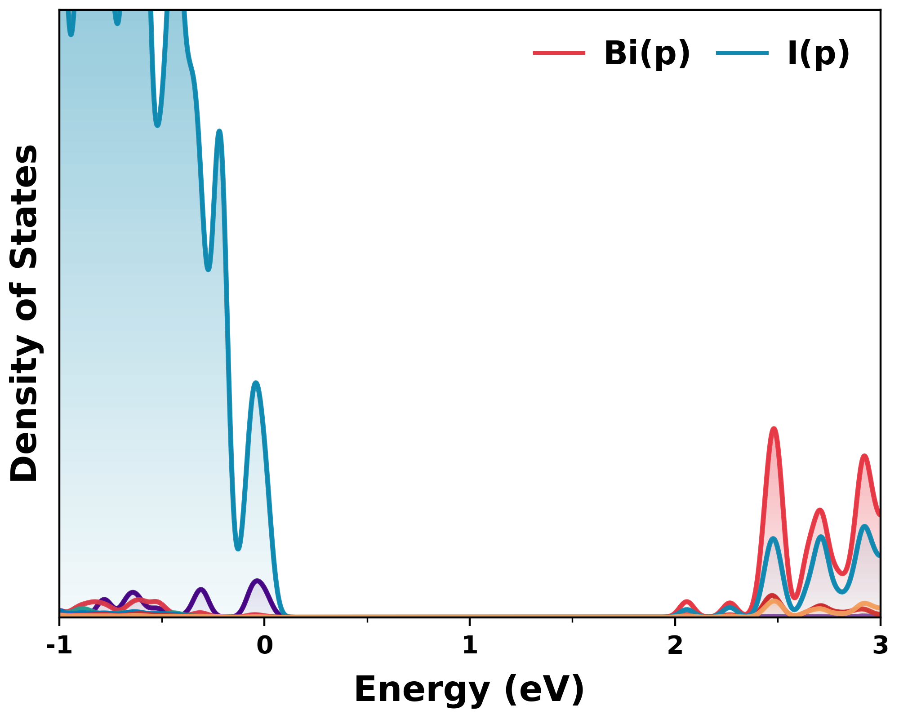
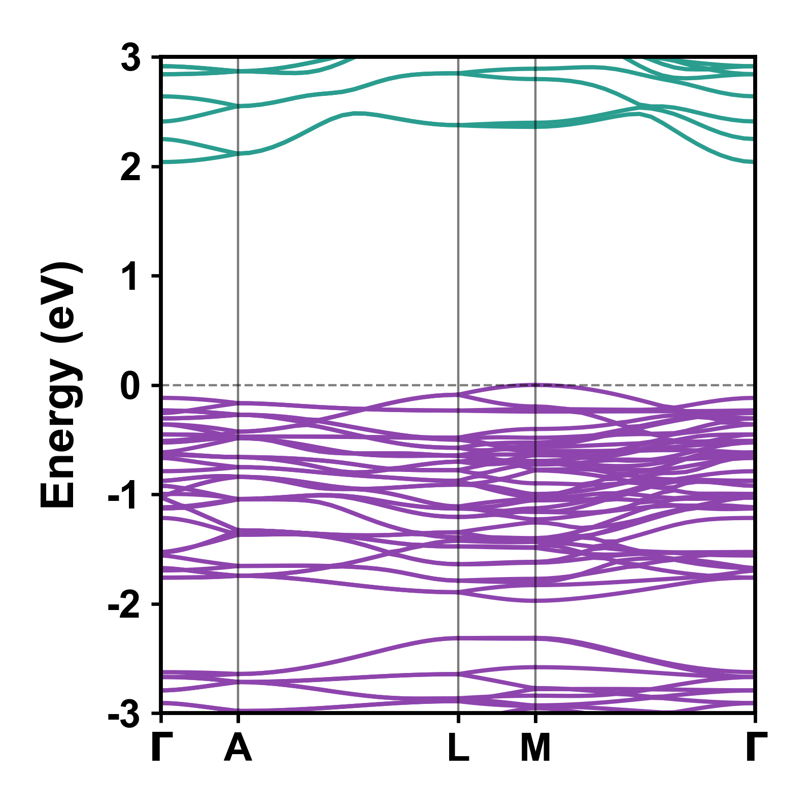

<p align="center">
  
</p>

# Valyte

**Valyte** is a CLI tool for VASP workflows — pre-processing and post-processing — built for clean, publication-quality output.

---

## Features

### Pre-processing

| Command | Description |
|---|---|
| [`valyte supercell`](preprocessing.md#supercell) | Generate supercells from POSCAR files |
| [`valyte kpt`](preprocessing.md#k-points-interactive-scf-grid) | Interactive KPOINTS generation (Monkhorst-Pack / Gamma) |
| [`valyte band kpt-gen`](band.md#1-generate-kpoints) | Automatic high-symmetry k-path (Bradley-Cracknell by default) |
| [`valyte potcar`](preprocessing.md#potcar) | Generate POTCAR from POSCAR species |

### Post-processing

| Command | Description |
|---|---|
| [`valyte dos`](dos.md) | Total and projected DOS with orbital resolution and gradient fills |
| [`valyte band`](band.md#2-standard-band-structure-plot) | Color-coded band structure with VBM aligned to 0 eV |
| [`valyte band --tricolor`](band.md#3-tricolor-orbital-resolved-plot) | **Orbital-resolved tricolor band structure** |
| [`valyte ipr`](ipr.md) | Inverse Participation Ratio from PROCAR |

---

## Installation

```bash
pip install valyte
```

To update:

```bash
pip install --upgrade valyte
```

Or from source:

```bash
git clone https://github.com/nikyadav002/Valyte-Project
cd Valyte-Project
pip install -e .
```

---

## Gallery

<p align="center">
  
  
</p>
