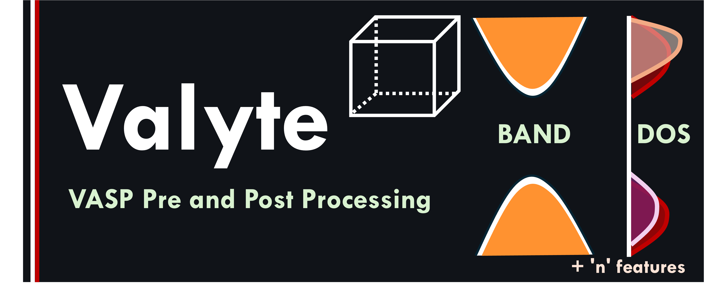
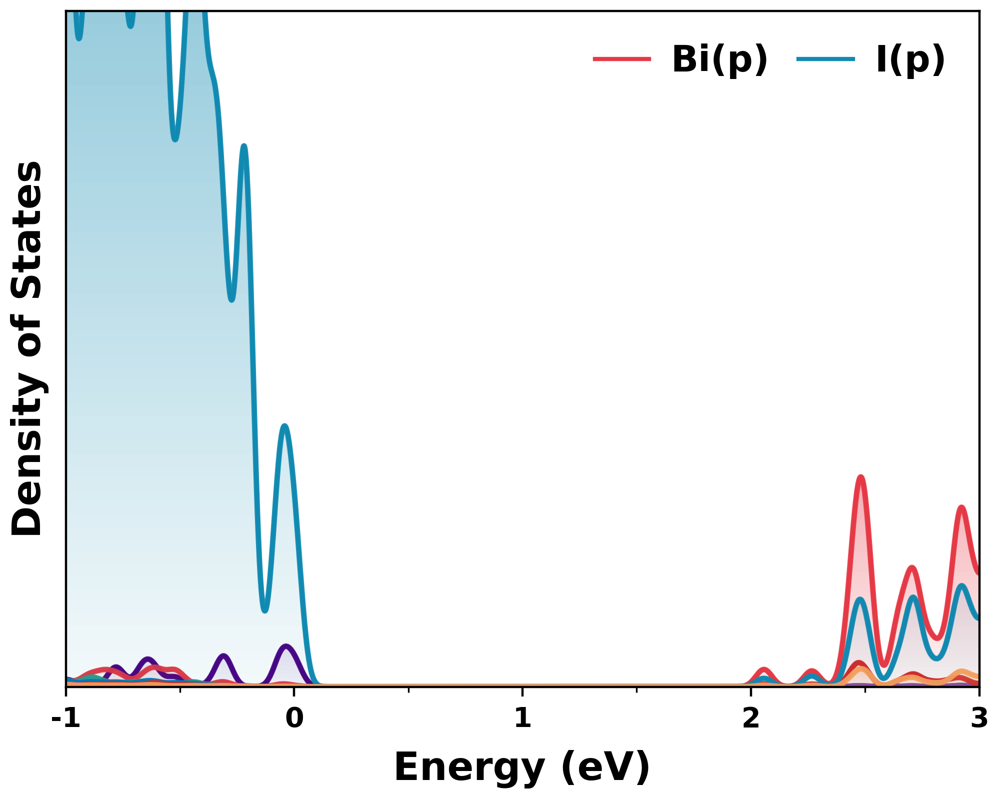
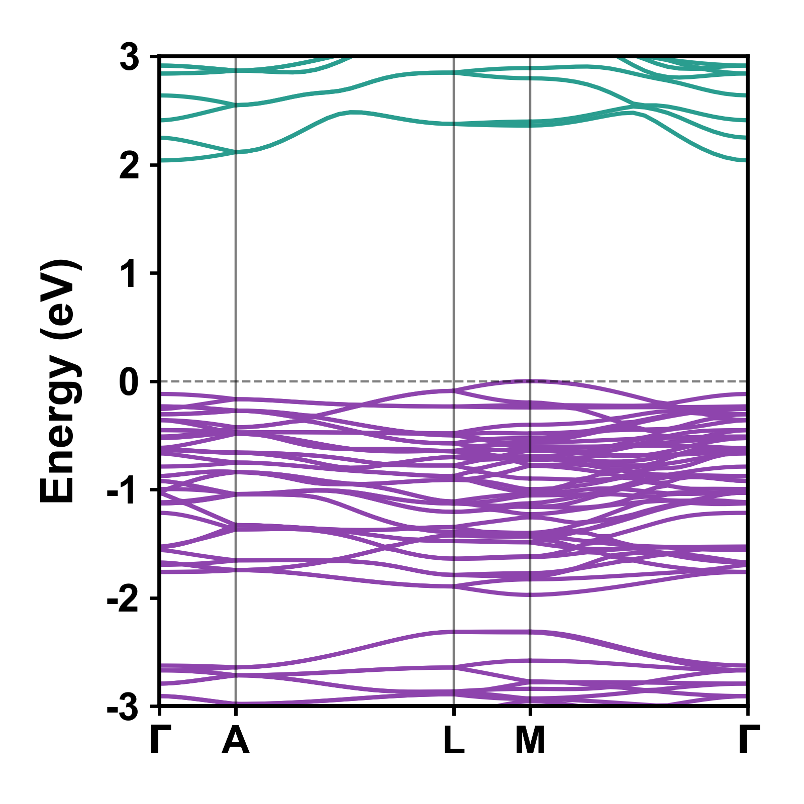

<p align="center">
  
</p>

# Valyte

**VASP pre- and post-processing from one command line.**

If you run VASP, you know how this goes. The calculation finishes, and then you
go looking for the plotting script you wrote six months ago and can't quite
remember how to call. Valyte started as a way to stop doing that.

Point it at a finished run and it reads what VASP left behind (`vasprun.xml`,
`PROCAR`, `OSZICAR`, `OUTCAR`, `POSCAR`) and hands you a figure or a data file.
One command per job. The defaults try to give you something you could drop into
a paper as-is, and when they don't suit you, almost all of them can be changed.

---

## Quick start

```bash
pip install valyte
```

Then change into a directory with your VASP output and try any of these:

```bash
valyte dos                      # density of states
valyte band                     # band structure
valyte converge                 # relaxation convergence table
```

If you'd rather see the whole thing end to end, the
**[Getting Started guide](getting-started.md)** walks through a calculation from
setup to finished figure.

---

## Commands

### Setting up a calculation

| Command | What it does |
|---|---|
| [`valyte supercell nx ny nz`](preprocessing.md#supercell) | Build a supercell from a POSCAR |
| [`valyte kpt`](preprocessing.md#k-points-scf-grid) | Write a KPOINTS grid (Monkhorst-Pack or Gamma). Runs interactively if you pass no flags |
| [`valyte band kpt-gen`](band.md#1-generate-kpoints) | Write a line-mode KPOINTS along a high-symmetry path, Bradley-Cracknell by default |
| [`valyte potcar`](preprocessing.md#potcar) | Concatenate a POTCAR for the species in a POSCAR |

### Analysing the output

| Command | What it does |
|---|---|
| [`valyte dos`](dos.md) | Total and projected DOS, orbital resolved, with gradient fills |
| [`valyte dos --panels`](dos.md) | The same DOS split into stacked panels, one per element (`--panel-by orbital` for orbitals instead) |
| [`valyte band`](band.md#2-standard-band-structure-plot) | Band structure with the VBM placed at 0 eV |
| [`valyte band --tricolor s p d`](band.md#3-tricolor-orbital-resolved-plot) | Orbital-projected bands colored by three specs. Accepts `s`, `Fe`, `Fe:d`, `O(p)` |
| [`valyte band --spin-resolved`](band.md#4-spin-resolved-band-structure-collinear) | Spin-up and spin-down channels in separate colors |
| [`valyte band --spin-texture sz`](band.md#5-non-collinear-spin-texture) | Non-collinear spin texture, bands colored by `sx`, `sy` or `sz` |
| [`valyte combined`](combined.md) | Band structure and DOS side by side on a shared energy axis |
| [`valyte effmass`](effmass.md) | Carrier effective masses at the VBM and CBM by parabolic fitting |
| [`valyte ipr`](ipr.md) | Inverse participation ratio from a PROCAR, for judging localization |
| [`valyte bandgap`](cli-reference.md#valyte-bandgap) | Print the band gap and nothing else |
| [`valyte converge`](converge.md) | Per-step energy, force and pressure table for a structural relaxation |
| [`valyte bz`](bz.md) | First Brillouin zone with the suggested high-symmetry k-path |

A couple of these need the right flags set in VASP: `--tricolor` and
`--spin-texture` read projections out of `vasprun.xml`, so the run needs
`LORBIT >= 11`, and spin texture needs a non-collinear calculation on top of
that. If a plot comes out empty, that's usually why.

### Shared options

The four commands that draw figures (`dos`, `band`, `combined`, `effmass`) all
take the same output flags, so once you know them they work everywhere:

| Flag | Effect |
|---|---|
| `--save-data` | Also write the plotted numbers to a `.dat` file |
| `--format {png,pdf,svg}` | Figure format |
| `--dpi` | Resolution for raster output (default 400) |
| `--no-bold` | Lighter type and thinner lines, closer to a journal house style |

A few small exceptions: `valyte effmass` only draws its fit if you ask for it
with `--plot`, `valyte converge` takes `--save-data` even though it prints a
table rather than a figure, and `valyte ipr` always writes `ipr_procar.dat`
(pass `-o` to name it something else).

---

## Gallery

<p align="center">
  
  
</p>

<p align="center">
  <em>Left: Orbital-resolved density of states with gradient fills. Right: Color-coded band structure with VBM at 0 eV.</em>
</p>

---

## Explore the documentation

<div class="grid cards" markdown>

-   :material-rocket-launch:{ .lg .middle } **Getting Started**

    ---

    Installation, prerequisites, and your first plot.

    [:octicons-arrow-right-24: Get started](getting-started.md)

-   :material-chart-line:{ .lg .middle } **Band Structure**

    ---

    Standard, tricolor, spin-resolved, and spin-texture band plots.

    [:octicons-arrow-right-24: Band modes](band.md)

-   :material-chart-bell-curve-cumulative:{ .lg .middle } **Density of States**

    ---

    Total and projected DOS with orbital resolution and gradient fills.

    [:octicons-arrow-right-24: DOS plotting](dos.md)

-   :material-scale-balance:{ .lg .middle } **Effective Mass**

    ---

    Carrier effective masses from parabolic fitting at VBM/CBM.

    [:octicons-arrow-right-24: Effective mass](effmass.md)

-   :material-check-circle:{ .lg .middle } **Convergence**

    ---

    Per-step convergence tables for structural relaxations.

    [:octicons-arrow-right-24: Convergence](converge.md)

-   :material-console:{ .lg .middle } **CLI Reference**

    ---

    Every command and flag in one searchable page.

    [:octicons-arrow-right-24: CLI reference](cli-reference.md)

</div>

---

## Acknowledgements

Valyte stands on pymatgen, seekpath, numpy, scipy and matplotlib, and wouldn't
be much without them. Thanks to everyone who maintains those, and to
[sumo](https://github.com/SMTG-Bham/sumo) and the other open-source VASP tools
that worked this out before I did.
